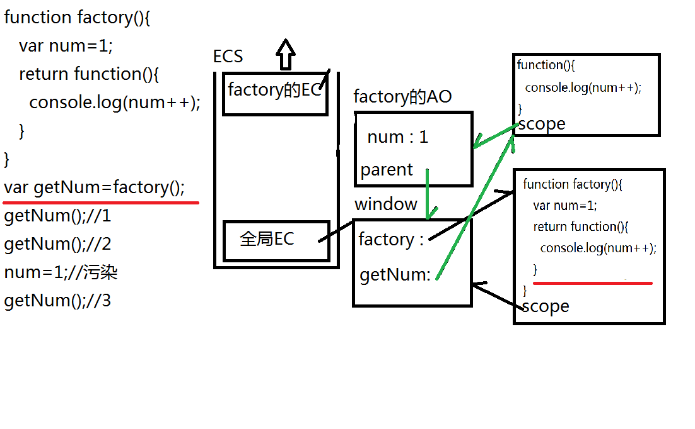
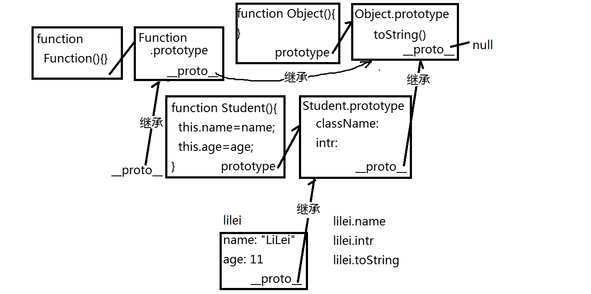
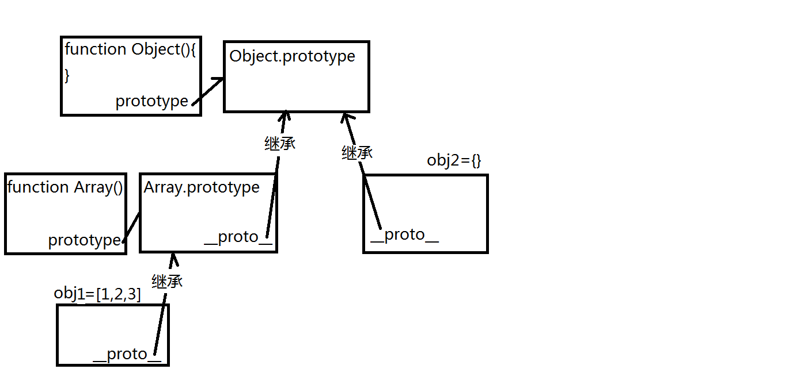

<!--
 * @Description: 
 * @Author: jinxiaojian
 * @Email: jinxiaojian@youxin.com
 * @Date: 2019-04-01 11:19:49
 * @LastEditTime: 2020-01-14 14:27:16
 * @LastEditors: 靳肖健
 -->
# js

类型
- 原始 string number boolean null undefined
- 引用 object


```
&& false 阻断    || true 阻断
```


全局变量:global

- 原型链 查找 对象属性 原型继承的实现方式
- 作用域链 解析 标识符 词法作用域的实现方式

复制对象的核心:JSON化
var newobj =JSON.parse(JSON.stringify(obj))

arguments:类数组对象 访问参数

定义函数:函数声明 函数表达式 构造函数

全局函数:parseInt isNaN eval parseFloat encodeURI decodeURI

数组变栈: push() pop()

正则表达式为字符串描述特定字符串

正则:
- 结合String:replace search match
- 定义RegExp:exec test

匿名无名直调,不重临时无污染

任何js片段都有作用域链,上面有对象,属性为变量;顶层全局,函数局部;区域运行,生成活动,需要变量,向上查找.运行完成,活动回收.



闭包:作用域内保存内变量
- 局部变量
- 内嵌函数
- 外部使用

自定义对象:
- 直接量
- 构造函数
- new
- create

this:指定当前对象
- 方法:this指 函数:this不(全局,undefined)

继承:
- 函数对象有方法与属性.
- prototype存原型,共享属性与方法
-  自有独有:hasOwnProperty
-  继承共有:in




继承:
修改构造函数原型
单独修改一个对象原型

继承都源于原型

```
function B(){}
function A(){}

B.prototye=new A();

B.prototype=A.prototype

var b=new B();
Object.setprotype(b,new A())

function B(){
    Object.setprototype(this,new A())
}
```

call参数,apply数组,间接调用函数


