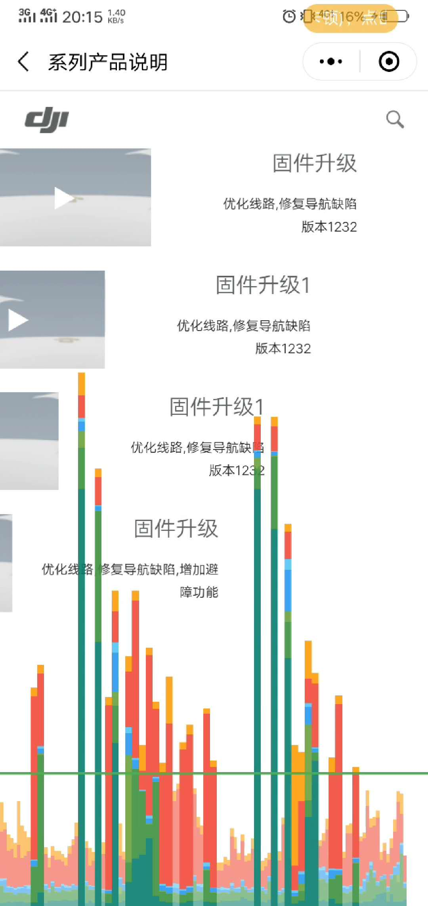

<!--
 * @Description:
 * @Author: jinxiaojian
 * @Email: jinxiaojian@youxin.com
 * @LastEditors: 靳肖健
 * @Date: 2019-04-01 11:19:50
 * @LastEditTime: 2019-04-11 11:59:16
 -->

# 关于微信小程序多元素运动卡顿问题的见解

微信动画卡顿的问题其实挺难解决的，因为多个元素，同时在这个浏览器里面进行运动的话，很容易碰到性能瓶颈。

因为微信跟原生应用还不一样. 原生应用，在里面写。可以更直接地调用系统 API，至今通过系统进行加速。

而微信小程序不一样，微信小程序。他运行在微信的浏览器里面提供微信要占了一部分资源，他分给小程序调用的应用资源是有限的。这部分的性能其实并不是太高的,没办法同时支持多个元素进行运动。

为了解决这种问题还查阅了很多资料，通常的开发方式这个问题是不可避免的。即使里面用了网上搜索的各种的那种资料，开启 GPU 加速, 用转换来写它的运动过程。但是, 因为多个元素太同时运转，因为咱们这个列表是得用 css 的渲染器来给他进行贴图，并且还得计算运动过程。所以就特别容易触碰到性能瓶颈。就是触碰到微信浏览器的性能瓶颈，这样一触碰了性能瓶颈的话，他自然就会卡顿了。

如果想规避这个问题，有两种写法。一个就是说只控制一个元素，在一段时间里运动，比如这个列表上的条目第一个运动完了，第二个在运动，第三个运动这种方式。还有一种就是做小游戏的那种方式的就是在里面绘制一张画布。但是就是用游戏动画的写法,成本是很高很高的。

就跟上面的图片一样，每当遇到切换要进行动画的时候。他几乎都会触碰到境内的红线。就是说达到了性能峰值。并不是说这个应用他很资源，只是说有两点: 第一点是这个峰值耗能太多,超过了微信的要求。就是说超过了微信小程序浏览器里面分配给他的资源。第二,就是说微信小程序里面滴浏览器在执行这个动画的时候。他是页面先发送请求请求浏览器。请求浏览器的一篇完了，微信小微信的浏览器在请求本机的 API. 比原生多了一步。但通过中间部分损失了大量的性能导致卡顿. 所以导致市面上这种多元素切换的不容易见到, 写好多列表特效耗费的精力远超其他项目.
